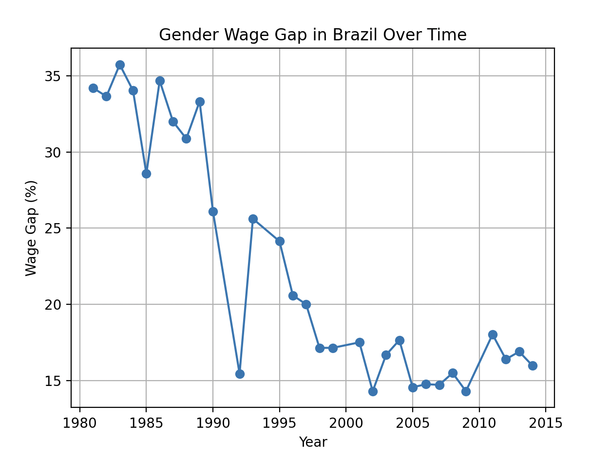
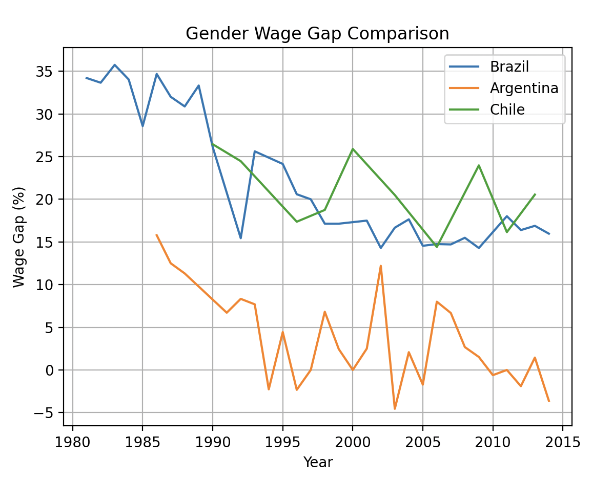

# Visualizing the Gender Pay Gap Across the World

## Project Overview
This project analyzes **gender wage gaps** across different countries and years, using the **Gender Economic Inequality Dataset** from Kaggle. The goal is to **visualize trends over time** and **compare wage gaps between multiple countries**.

---

## Graphs Created
1. Gender Wage Gap in Brazil Over Time

   ## Gender Wage Gap in Brazil Over Time

This graph shows how the gender wage gap in Brazil has changed over the years.

2. Gender Wage Gap Comparison Between Countries
  

This graph compares the gender wage gap between multiple countries over time.

## Libraries Used and What They Do
pandas

#### What it does: Helps us work with data tables.
Why we used it: It loads the paygap.csv file and lets us explore, filter, and organize the data.
matplotlib

#### What it does: Helps us make graphs and charts.
Why we used it: It allows us to visualize the gender wage gap over time by plotting the data for different countries.

This project uses the Gender Economic Inequality Dataset from Kaggle.
You can find the dataset here:
Gender Economic Inequality Dataset – Kaggle

